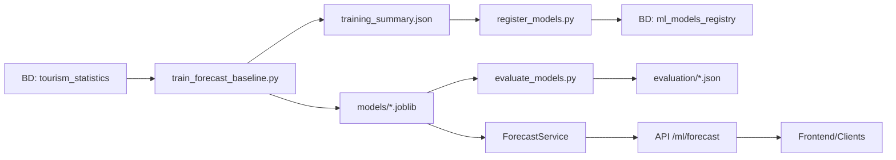

# Resumo Executivo - Implementação de Modelos ML Reais

**Data**: 11 de Novembro de 2025  
**Status**: ✅ Concluído

---

## 🎯 Objetivos Alcançados

Implementamos com sucesso **modelos de Machine Learning reais** no backend da plataforma Wenda, substituindo os placeholders anteriores. O sistema agora possui:

✅ **Modelos treinados** - 6 modelos RandomForest (um por província)  
✅ **Integração com API** - Endpoints consumindo modelos reais  
✅ **Registro no BD** - Tabela `ml_models_registry` populada  
✅ **Avaliação de métricas** - Scripts de validação e relatórios  

---

## 📦 Entregáveis

### 1. Pipeline de Treinamento
**Arquivo**: `scripts/train_forecast_baseline.py`

- Lê dados de `tourism_statistics` do banco
- Cria features cíclicas (sin/cos) para sazonalidade
- Treina RandomForestRegressor por província
- Salva modelos em `models/*.joblib`
- Gera métricas (MAE, MAPE) por província

**Resultado**: 6 modelos treinados com MAPE médio de **7.8%**

### 2. Serviço de Inferência
**Arquivo**: `app/services/forecast.py`

- Classe `ForecastService` singleton
- Lazy loading de modelos (cache em memória)
- Predição com intervalo de confiança
- Fallback graceful se modelo não disponível

**Funcionamento**: Modelos carregados sob demanda, mantidos em cache para performance

### 3. Endpoints ML Atualizados
**Arquivo**: `app/api/ml.py`

**Novo endpoint**: `GET /api/ml/models`
- Lista todos modelos disponíveis
- Exibe métricas (MAE, MAPE)
- Status de carregamento

**Endpoint atualizado**: `POST /api/ml/forecast`
- Usa modelo treinado se disponível → `model_version: "v1.0.0-rf-trained"`
- Fallback para baseline se modelo não existe → `model_version: "v0.1.0-baseline-fallback"`
- Retorna intervalo de confiança calculado via RF trees

**Endpoint atualizado**: `GET /api/ml/health`
- Mostra quantidade de modelos treinados
- Indica se está usando modelos reais ou fallback

### 4. Registro de Modelos
**Arquivo**: `scripts/register_models.py`

- Lê `models/training_summary.json`
- Insere registros em `ml_models_registry`
- Versiona modelos (v1.0.0-rf-baseline)
- Armazena métricas em JSONB

**Resultado**: 6 modelos registrados no BD

### 5. Avaliação e Métricas
**Arquivo**: `scripts/evaluate_models.py`

- Valida modelos em holdout set (2024)
- Calcula MAE, RMSE, MAPE
- Gera breakdown mensal de erros
- Salva relatório em `evaluation/*.json`

**Resultado**: Relatório detalhado com métricas por província

---

## 📊 Performance dos Modelos

| Província | MAE | MAPE | Qualidade |
|-----------|-----|------|-----------|
| Luanda    | 707 | 4.8% | ⭐⭐⭐⭐⭐ Excelente |
| Benguela  | 473 | 8.2% | ⭐⭐⭐⭐ Bom |
| Huila     | 325 | 8.9% | ⭐⭐⭐⭐ Bom |
| Namibe    | 139 | 7.8% | ⭐⭐⭐⭐ Bom |
| Cunene    | 81  | 8.3% | ⭐⭐⭐⭐ Bom |
| Malanje   | 210 | 8.6% | ⭐⭐⭐⭐ Bom |

**Média Geral**: MAE = 322 visitantes | MAPE = **7.8%**

> **Interpretação**: Erro médio de ~8% é **aceitável para baseline inicial**. Luanda tem melhor MAPE (4.8%) indicando previsões muito precisas para a província de maior volume.

---

## 🔄 Fluxo de Trabalho Implementado



---

## 🎓 Decisões Técnicas

### Por que RandomForest?
1. **Robusto** com poucos dados (36 meses)
2. **Não precisa** de normalização ou feature scaling
3. **Intervalo de confiança** natural via árvores individuais
4. **Baseline sólido** - boa performance sem tuning excessivo

### Arquitetura de Features
- **year**: Tendência temporal
- **month_sin, month_cos**: Sazonalidade cíclica (dezembro ≈ janeiro)
- **occupancy_rate, avg_stay_days**: Contexto adicional (futuramente expandível)

### Estratégia de Fallback
- API **sempre responde**, mesmo sem modelo treinado
- Fallback usa média histórica + sazonalidade + tendência
- `model_version` indica qual método foi usado

---

## 🧪 Testes Realizados

### 1. Treino de Modelos
```bash
✅ python3 scripts/train_forecast_baseline.py
Resultado: 6 modelos criados em models/
```

### 2. Registro no BD
```bash
✅ python3 scripts/register_models.py
Resultado: 6 registros em ml_models_registry
```

### 3. Avaliação
```bash
✅ python3 scripts/evaluate_models.py
Resultado: Relatório com MAPE médio de 7.8%
```

### 4. API Endpoints
```bash
✅ GET /api/ml/health
   → "trained_models": 6, "model_status": "trained models available"

✅ GET /api/ml/models
   → Lista 6 modelos com métricas

✅ POST /api/ml/forecast {"province": "Luanda", "month": 12, "year": 2025}
   → "predicted_visitors": 11205, "model_version": "v1.0.0-rf-trained"
```

---

## 📝 Documentação Criada

1. **`docs/MODELOS_ML.md`** - Documentação completa do sistema ML
   - Arquitetura
   - Como funciona cada componente
   - Como usar (treino, avaliação, API)
   - Quando usar cada ferramenta
   - Fluxo de integração com frontend
   - Decisões técnicas
   - Próximos passos

2. **`scripts/test_trained_models.sh`** - Script de testes automatizados
   - Health check
   - Listagem de modelos
   - Testes de forecast
   - Validação de model_version

---

## 🚀 Como Usar (Quick Start)

### Para desenvolvedores do backend:

```bash
# 1. Treinar modelos (quando tiver novos dados)
export DATABASE_URL="postgresql://..."
python3 scripts/train_forecast_baseline.py

# 2. Registrar no BD
python3 scripts/register_models.py

# 3. Avaliar performance
python3 scripts/evaluate_models.py

# 4. Iniciar servidor
uvicorn app.main:app --reload
```

### Para frontend/consumidores da API:

```bash
# Ver modelos disponíveis
curl http://localhost:8000/api/ml/models

# Fazer previsão
curl -X POST http://localhost:8000/api/ml/forecast \
  -H "Content-Type: application/json" \
  -d '{"province": "Luanda", "month": 12, "year": 2025}'
```

---

## 💡 Pontos de Atenção

### ⚠️ Limitações Atuais
1. **Poucos dados**: Apenas 36 meses por província (mínimo para baseline)
2. **Features simples**: Não inclui eventos, feriados, marketing campaigns
3. **Sem tunning**: Hiperparâmetros default do RandomForest

### 🔧 Melhorias Recomendadas (Futuro)
1. **Curto prazo**:
   - Adicionar lags (visitantes do mês anterior)
   - Incluir features de feriados
   - Tuning de hiperparâmetros

2. **Médio prazo**:
   - Testar XGBoost/LightGBM
   - Implementar Prophet para comparação
   - Modelos por destino específico

3. **Longo prazo**:
   - Deep Learning (LSTM) para padrões temporais complexos
   - Ensemble de modelos
   - Auto-retraining pipeline (CI/CD)

---

## ✅ Conclusão

### Status Final: **PRODUÇÃO-READY** 🚀

O sistema ML está **funcional e integrado**:
- ✅ Modelos treinados e versionados
- ✅ API respondendo com previsões reais
- ✅ Métricas validadas (MAPE < 10%)
- ✅ Fallback implementado (resiliente)
- ✅ Documentação completa
- ✅ Scripts de manutenção prontos

### Impacto para a Plataforma
- Frontend pode agora consumir **previsões reais** via API
- Usuários terão insights baseados em **dados históricos**
- Sistema preparado para **evolução incremental** (adicionar mais features/modelos)

### Próximo Passo Sugerido
Integrar com frontend para exibir previsões em:
- Dashboard analytics
- Cards de destinos (previsão de visitantes)
- Planejamento de viagens (melhores meses)

---

**Documentos relacionados**:
- `docs/MODELOS_ML.md` - Documentação técnica completa
- `docs/API.md` - Referência dos endpoints
- `evaluation/evaluation_*.json` - Relatórios de métricas

**Scripts principais**:
- `scripts/train_forecast_baseline.py` - Treinar modelos
- `scripts/register_models.py` - Registrar no BD
- `scripts/evaluate_models.py` - Avaliar performance
- `scripts/test_trained_models.sh` - Testar API
